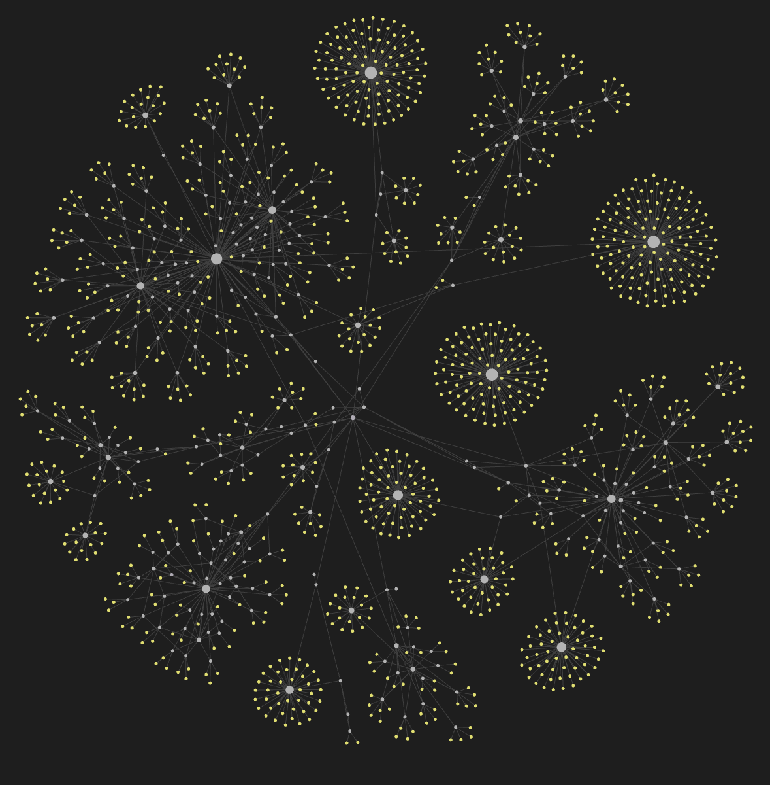

# University Brain

> ### [Онлайн база знаний](https://stepanovplaton.github.io/university_brain_2023_01/) собранная потоком СамГУ ФИИТ 2023-2024 и курируемая мной. 

## Что это и что здесь есть?
- Эта база знаний - немного из того, что сохранил и структурировал поток ФИИТ 2023
- Это неофициальный сборник того, что нам показалось нужным
- Здесь вы найдёте:
  - Конспекты лекций
  - Контакты преподавателей
  - Электронные версии учебников
  - Презентации и другие материалы от преподавателей
  - Условия лабораторных работ
  - Списки вопросов с экзаменов, билеты (и ответы на них разных ИИ)
- У нас много всякого:
  - 276 текстовых заметок
  - 1322 вложения
  - 950мб полезных данных

## Статус проекта - несмешной стендап
- Мы что-то **записали**, но точно не всё, и точно что-то не совсем так
- Мы что-то **сохранили**. Не всё, но то, что успели и посчитали нужным и полезным
- Мы что-то **отсортировали**, и как-то это назвали, чтобы не запутаться, но тут всё равно немного бардак

## Помочь проекту:
Вся эта база развивается только силами энтузиастов. Мы будем рады любой помощи!

- **Исправление ошибок**. Если вы заметили неточность, ошибку или у вас есть идеи по реорганизации, пишите свои идеи модераторам
- **Предоставление конспектов**. Если у вас читаемый почерк и есть конспекты, которые у нас ещё не добавлены - обязательно пишите и предлагайте свою помощь
- **Организация**. Если вы знаете язык разметки Markdown, или работали с Obsidian ваши навыки обязательно пригодятся, чтобы сделать нашу базу красивее!

## Как это работает

### Так выглядит наша база, если отрисовать её в виде связанного графа

- Мы вдохновлялись методом [Цеттелькастен](https://ru.wikipedia.org/wiki/%D0%A6%D0%B5%D1%82%D1%82%D0%B5%D0%BB%D1%8C%D0%BA%D0%B0%D1%81%D1%82%D0%B5%D0%BD)
- База состоит из небольших заметок на базе языка разметки Markdown
- Каждая заметка ссылается на другие заметки и вложения
- Несколько заинтересованных людей оцифровывали лекции и собирали документы, прикрепляли их в заметки, а потом одни заметки прикрепляли в другие заметки
- Мы редактируем базу с помощью программы [Obsidian](https://obsidian.md/)
- Все файлы вместе хранятся в [репозитории на GitHub](https://github.com/StepanovPlaton/quartz)
- [Quartz](https://quartz.jzhao.xyz/) помогает нам собрать из связанных Markdown заметок статический сайт
- После коммита [GitHub Аctions](https://github.com/features/actions) обрабатывает наши заметки с помощью Quartz, и выкладывает получившийся сайт на бесплатный хостинг [GitHub Pages](https://pages.github.com/)
